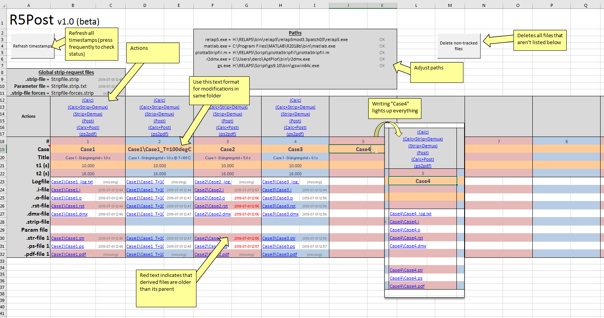

# R5Post
Spreadsheet based tool to batch run RELAP5 calculations and subsequent post-processing

## Idea
By using the timestamps of the file created during the calculation and post-processing chain it's easy to see what files/cases are up to date. If they are out of date it is easy to control the work flow from one place.

## Structure
Place R5Post.xlsm in a parent folder to your cases. Then write the relative path to the RELAP5 input file (Case1\Case1.i) and all files that are to be created is lit up automatically.

## Installation
1. Place R5Post.xlsm in a parent folder to your cases
2. Update all program paths and push the "Refresh timestamps" button. Make sure an "OK" is shown after the paths.
3. On the row titles "Case" write the relative path to your RELAP5 inputfile (If your inputfile is named the same as the folder only "Case1" will suffice to link to Case1\Case1.i and Case1\Case1.XXX).
4. Press the "Calc"-link for Case1 and a RELAP5 calculation will start.
